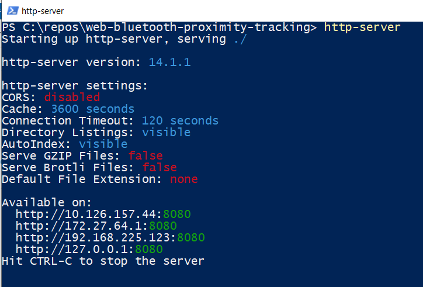

# Distance Monitoring Demo

This web app demonstrates the use of the Web Bluetooth API for getting distance between 2 devices by using bluetooth channel sounding
service.

## Requirements
- Install [Nodejs >= v22.14.0 LTS](https://nodejs.org/en/download) 
- Prepare and flash a development kit with one of the [supported application examples]().

## Getting Started: Run the Application Locally

 1. Go to [project-root]
 2. Open a Terminal/Cmd/PowerShell/Bash there
 3. Install a simple http-server by running the following command
    > npm install -g http-server
 4. Run the http server in the project root by running the following command
    > http-server
    
 5. Open the application in a web browser
    > [!NOTE]  
    > The local address of the application is displayed in the console once the server is up and ready to process the requests.